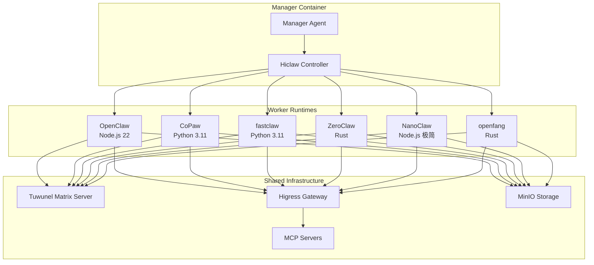

# 集成 Claw Worker 运行时技术方案

需求名称：integrate-claw-workers
更新日期：2026-04-24

## 概述

在 HiClaw 现有的 OpenClaw 和 CoPaw Worker 运行时基础上，新增 4 种内部 Worker 类型，用于替代或补充现有的 OpenClaw/CoPaw：

| Worker 类型 | 技术栈 | 核心特点 | 资源占用 | 适用场景 |
|------------|--------|---------|---------|---------|
| **fastclaw** | Python | 轻量级 Python Agent，易集成 | ~300MB 内存 | 快速原型开发、Python 生态集成 |
| **ZeroClaw** | Rust | 超高性能，QPS 提升 50 倍 | 180MB 内存 | 高并发、金融/电信场景 |
| **NanoClaw** | Node.js (极简) | ~500 行代码，容器化安全运行 | ~100MB 内存 | 个人助手、资源受限环境 |
| **openfang** | Rust | 企业级高性能框架 | 200MB 内存 | 企业生产环境、高可用性场景 |

## 架构

### 整体架构



### 关键设计决策

1. **统一接口规范**：所有 Worker 运行时遵循相同的 Worker 协议
   - Matrix 通信协议（与 Manager 和 Human 交互）
   - MinIO 文件同步（配置和状态管理）
   - Higress 网关集成（LLM 代理和 MCP 访问）
   - 统一的 health check 和 heartbeat 机制

2. **运行时抽象层**：在 hiclaw-controller 中引入 Worker Runtime 抽象
   ```go
   type WorkerRuntime interface {
       Create(opts WorkerOptions) error
       Start(name string) error
       Stop(name string) error
       HealthCheck(name string) (HealthStatus, error)
   }
   ```

3. **向后兼容**：现有的 OpenClaw 和 CoPaw 继续支持，新增的 4 种 runtime 作为可选项

## 组件和接口

### 1. fastclaw (Python 轻量级 Agent)

**定位**：Python 生态友好的轻量级 Agent

**技术架构**：
```
┌─────────────────────────────────────┐
│         WhatsApp/Matrix 接口          │
└──────────────┬──────────────────────┘
               │
               ▼
┌─────────────────────────────────────┐
│      fastclaw Core (Python)         │
│   - Claude SDK / OpenAI SDK         │
│   - 极简任务调度器                   │
│   - 容器化执行环境                   │
└──────────────┬──────────────────────┘
               │
               ▼
┌─────────────────────────────────────┐
│         工具层 (Skills)              │
│   - HTTP 请求                        │
│   - 文件操作                         │
│   - 代码执行                         │
└─────────────────────────────────────┘
```

**集成方式**：
- Docker 镜像：`hiclaw/fastclaw-worker:latest`
- 入口脚本：`/app/fastclaw-entrypoint.sh`
- 配置格式：兼容 OpenClaw 的 `openclaw.json`（重命名为 `fastclaw.json`）

### 2. ZeroClaw (Rust 高性能运行时)

**定位**：金融/电信等高并发场景

**技术架构**：
```
┌─────────────────────────────────────┐
│         Matrix Client (Rust)        │
│         rumatrax / matrix-sdk       │
└──────────────┬──────────────────────┘
               │
               ▼
┌─────────────────────────────────────┐
│      ZeroClaw Core (Rust)           │
│   - 异步运行时 (tokio)               │
│   - LLM 客户端 (reqwest)             │
│   - MCP CLI 调用                     │
└──────────────┬──────────────────────┘
               │
               ▼
┌─────────────────────────────────────┐
│         Skills (Rust/WASM)          │
│   - 编译为 native 或 WASM 模块        │
│   - 零成本抽象，极致性能             │
└─────────────────────────────────────┘
```

**性能指标**：
- 单核 QPS: 6800 (vs OpenClaw 120)
- P99 延迟：12ms (vs OpenClaw 450ms)
- 内存占用：180MB

**集成方式**：
- Docker 镜像：`hiclaw/zeroclaw-worker:latest`
- 静态二进制：~3.4MB（Musl libc 编译）
- 配置格式：JSON（与 OpenClaw 兼容）

### 3. NanoClaw (极简 Node.js Agent)

**定位**：个人助手、资源受限环境

**技术架构**：
```
┌─────────────────────────────────────┐
│      WhatsApp Interface             │
│      (Baileys / WWeb.js)           │
└──────────────┬──────────────────────┘
               │
               ▼
┌─────────────────────────────────────┐
│      NanoClaw Core (~500 LOC)       │
│   - Claude Agent SDK                │
│   - 极简对话管理                     │
│   - 容器化执行 (5 分钟超时)            │
└──────────────┬──────────────────────┘
               │
               ▼
┌─────────────────────────────────────┐
│      按需加载 Skills                 │
│   - 由 Claude Code 动态生成          │
└─────────────────────────────────────┘
```

**核心特点**：
- 代码量：~500 行（极易理解和定制）
- 依赖：极少（仅核心依赖）
- 安全：容器化运行，5 分钟自动销毁
- 定制：通过对话让 AI 帮忙添加功能

**集成方式**：
- Docker 镜像：`hiclaw/nanoclaw-worker:latest`
- Matrix 适配：需在 Baileys (WhatsApp) 基础上增加 Matrix 插件
- 配置：无需复杂配置，通过对话初始化

### 4. openfang (Rust 企业级框架)

**定位**：企业生产环境、高可用性场景

**技术架构**：
```
┌─────────────────────────────────────┐
│      Matrix Client (Rust)           │
│      matrix-rust-sdk                │
└──────────────┬──────────────────────┘
               │
               ▼
┌─────────────────────────────────────┐
│      openfang Core (Rust)           │
│   - 插件架构 (Plugin System)        │
│   - 热更新支持                        │
│   - 分布式追踪 (OpenTelemetry)      │
│   - 指标监控 (Prometheus)           │
└──────────────┬──────────────────────┘
               │
               ▼
┌─────────────────────────────────────┐
│      Enterprise Skills              │
│   - 企业 IM 集成（钉钉/飞书/企微）   │
│   - 数据库连接器                     │
│   - 消息队列集成                     │
│   - 审计日志                          │
└─────────────────────────────────────┘
```

**企业特性**：
- 高可用：支持集群部署
- 可观测性：内置 metrics, tracing, logging
- 安全：国密算法支持，等保四级合规
- 审计：全操作留痕

**集成方式**：
- Docker 镜像：`hiclaw/openfang-worker:latest`
- Helm Chart：支持 Kubernetes 部署
- 配置：YAML 声明式配置

### 5. hiclaw-controller 扩展

**新增 Worker Runtime Registry**：
```go
type RuntimeRegistry struct {
    runtimes map[string]WorkerRuntime
}

func (r *RuntimeRegistry) Get(runtimeType string) (WorkerRuntime, error)
func (r *RuntimeRegistry) Register(name string, runtime WorkerRuntime)
```

**Reconciler 逻辑**：
```go
func (r *WorkerReconciler) Reconcile(ctx context.Context, req Request) (Result, error) {
    worker := &Worker{}
    // 获取 Worker CRD
    // 根据 spec.runtime 选择合适的 Runtime
    runtime, err := r.RuntimeRegistry.Get(worker.Spec.Runtime)
    // 调用 runtime.Create/Start/Stop
}
```

### 6. Worker 协议规范

所有 Worker 运行时必须实现以下接口：

| 接口 | 描述 | 协议 |
|------|------|------|
| Matrix Communication | 与 Manager/Human 通信 | Matrix Client-Server API |
| File Sync | 配置和状态同步 | MinIO S3 API + mc mirror |
| Health Check | 健康检查 | HTTP `/healthz` endpoint |
| MCP Access | 调用 MCP 工具 | Higress Gateway + Consumer Token |
| Skills Loading | 技能加载 | MinIO `agents/{name}/skills/` |

## 数据结构

### Worker CRD 扩展

```yaml
apiVersion: hiclaw.io/v1beta1
kind: Worker
metadata:
  name: alice
spec:
  model: claude-sonnet-4-6
  runtime: fastclaw | zeroclaw | nanoclaw | openfang | openclaw | copaw  # 新增选项
  image: hiclaw/fastclaw-worker:latest                                    # 对应镜像
  skills:
    - github-operations
    - git-delegation
  mcpServers:
    - github
  package: file://./alice-worker.zip
  resources:                                                              # 新增资源限制
    requests:
      memory: "128Mi"
      cpu: "100m"
    limits:
      memory: "512Mi"
      cpu: "500m"
  runtimeConfig:                                                          # 新增运行时特定配置
    fastclaw:
      pythonVersion: "3.11"
      sdk: "claude"                                                       # 或 "openai"
    zeroclaw:
      wasmSupport: false
      concurrency: 100
    nanoclaw:
      containerTimeout: 300                                               # 秒
      channel: "whatsapp"                                                 # 或 "matrix"
    openfang:
      pluginDir: "/app/plugins"
      observability:
        enabled: true
        tracingEndpoint: "http://jaeger:14268"
        metricsEndpoint: "http://prometheus:9090"
```

### Runtime 配置模板

```json
{
  "runtime_types": {
    "openclaw": {
      "image": "hiclaw/worker-agent:latest",
      "default_resources": {"memory": "512Mi", "cpu": "500m"},
      "entrypoint": "/app/worker-entrypoint.sh"
    },
    "copaw": {
      "image": "hiclaw/copaw-worker:latest",
      "default_resources": {"memory": "256Mi", "cpu": "250m"},
      "entrypoint": "/app/copaw-worker-entrypoint.sh"
    },
    "fastclaw": {
      "image": "hiclaw/fastclaw-worker:latest",
      "default_resources": {"memory": "300Mi", "cpu": "300m"},
      "entrypoint": "/app/fastclaw-entrypoint.sh"
    },
    "zeroclaw": {
      "image": "hiclaw/zeroclaw-worker:latest",
      "default_resources": {"memory": "180Mi", "cpu": "200m"},
      "entrypoint": "/app/zeroclaw-entrypoint"
    },
    "nanoclaw": {
      "image": "hiclaw/nanoclaw-worker:latest",
      "default_resources": {"memory": "100Mi", "cpu": "100m"},
      "entrypoint": "/app/nanoclaw-entrypoint.sh"
    },
    "openfang": {
      "image": "hiclaw/openfang-worker:latest",
      "default_resources": {"memory": "512Mi", "cpu": "500m"},
      "entrypoint": "/app/openfang-entrypoint"
    }
  }
}
```

## 正确性属性

### 1. 向后兼容性

- **保证**：现有的 OpenClaw 和 CoPaw Worker 不受影响
- **验证**：所有现有测试用例必须通过
- **迁移路径**：无需迁移，新旧 runtime 共存

### 2. 接口一致性

- **保证**：所有 Worker runtime 实现相同的 Worker 协议
- **验证**：统一的集成测试套件
- **契约测试**：针对 Matrix 通信、文件同步、health check 的契约测试

### 3. 资源隔离

- **保证**：每个 Worker container 有独立的资源限制
- **验证**：Kubernetes/Docker resource limits 强制执行
- **监控**：Prometheus 指标采集和分析

### 4. 安全边界

- **保证**：Worker 无法访问其他 Worker 的配置和凭证
- **验证**：MinIO bucket 策略、网络策略、Consumer token 隔离

## 错误处理

### 1. Worker 启动失败

**场景**：镜像拉取失败、配置错误、端口冲突

**处理方式**：
```
1. hiclaw-controller 检测到 Pod/Container 启动失败
2. 记录事件到 Kubernetes Events / Manager logs
3. 根据 restartPolicy 决定是否重试
4. 通知 Manager Agent（用于通知 Human）
```

### 2. Runtime 不支持

**场景**：Worker CRD 指定了未注册的 runtime 类型

**处理方式**：
```
1. Webhook 验证：在 CRD 层面限制 runtime 值为枚举类型
2. Reconciler 拒绝创建，返回错误信息
3. 提示用户可用的 runtime 列表
```

### 3. 健康检查失败

**场景**：Worker 无响应、死锁、资源耗尽

**处理方式**：
```
1. Kubelet / Docker healthz 检测失败
2. 自动重启 container
3. 连续失败 3 次 → Pod 进入 CrashLoopBackOff
4. Manager 心跳检测到异常 → 通知 Human
```

### 4. 配置同步失败

**场景**：MinIO 不可达、权限不足、配置文件格式错误

**处理方式**：
```
1. Worker 重试机制（指数退避）
2. 重试 3 次失败 → 进入降级模式（使用缓存配置）
3. 上报错误到 Manager
4. Human 介入排查
```

## 测试策略

### 1. 单元测试

**测试范围**：
- hiclaw-controller 的 Runtime Registry 逻辑
- 各 Worker runtime 的核心逻辑
- 配置解析和验证

**覆盖率要求**：80%+

### 2. 集成测试

**测试场景**：
- Worker 创建、启动、停止全流程
- Matrix 通信端到端测试
- MinIO 文件同步测试
- Higress 网关集成测试

**测试框架**：
- Go testing + testcontainers（用于依赖服务）
- Matrix 测试 Homeserver

### 3. 性能测试

**测试指标**：
- 启动时间（冷启动、热启动）
- 消息处理延迟（P50, P95, P99）
- 并发处理能力（QPS）
- 资源占用（内存、CPU）

**基准对比**：
- OpenClaw vs fastclaw vs ZeroClaw vs openfang vs NanoClaw
- 不同负载下的性能表现

### 4. 压力测试

**测试场景**：
- 大规模 Worker 部署（100+ Workers）
- 高并发消息处理
- MinIO/Higress/Tuwunel 负载测试

## 实施计划

### Phase 1: 基础设施准备（2 周）

**任务**：
1. 定义 Worker Runtime 接口规范
2. 扩展 Worker CRD（runtime 字段、runtimeConfig 字段）
3. 实现 Runtime Registry
4. 扩展 hiclaw-controller Reconciler

**交付物**：
- Worker CRD v1beta1 更新
- hiclaw-controller Go 代码
- 集成测试框架

### Phase 2: fastclaw 实现（2 周）

**任务**：
1. fastclaw Core 开发（Python）
2. Matrix 客户端集成
3. MinIO 同步逻辑
4. Higress 集成
5. Docker 镜像构建

**交付物**：
- fastclaw-worker 镜像
- 配置文档
- 性能基准测试报告

### Phase 3: ZeroClaw 实现（3 周）

**任务**：
1. ZeroClaw Core 开发（Rust）
2. Matrix Rust SDK 集成
3. 异步运行时优化
4. 性能调优
5. Docker 镜像构建

**交付物**：
- zeroclaw-worker 镜像
- 配置文档
- 性能基准测试报告（vs OpenClaw）

### Phase 4: NanoClaw 适配（2 周）

**任务**：
1. NanoClaw Matrix 适配（从 WhatsApp 扩展）
2. 容器化运行逻辑
3. Claude Agent SDK 集成
4. Docker 镜像构建

**交付物**：
- nanoclaw-worker 镜像
- 配置文档
- 使用指南

### Phase 5: openfang 实现（3 周）

**任务**：
1. openfang Core 开发（Rust）
2. 插件系统实现
3. 可观测性集成（OpenTelemetry + Prometheus）
4. 企业特性开发（审计日志、国密算法）
5. Helm Chart 编写
6. Docker 镜像构建

**交付物**：
- openfang-worker 镜像
- Helm Chart
- 企业部署指南
- 性能基准测试报告

### Phase 6: 测试与文档（2 周）

**任务**：
1. 端到端集成测试
2. 性能测试和基准对比
3. 用户文档编写
4. 示例和最佳实践

**交付物**：
- 测试报告
- 用户文档
- 示例代码
- Release Notes

## 风险与缓解

| 风险 | 影响 | 概率 | 缓解措施 |
|------|------|------|---------|
| Rust 技术栈人才短缺 | 高 | 中 | 提前招聘/培训，或考虑外包 ZeroClaw/openfang 开发 |
| Matrix 协议兼容性 | 中 | 低 | 使用成熟的 Matrix SDK（matrix-rust-sdk, matrix-js-sdk） |
| 性能优化复杂度 | 高 | 中 | 分阶段实施，优先实现核心功能，后续迭代优化 |
| 企业特性开发周期 | 中 | 中 | 采用 MVP 策略，先实现核心功能，企业特性作为可选插件 |
| 测试覆盖率不足 | 中 | 高 | CI/CD 集成自动化测试，设定覆盖率门槛 |

## 引用链接

[^1]: [HiClaw Architecture](../../docs/architecture.md)
[^2]: [Team Worker Proposal](../../docs/design/team-worker-proposal.md)
[^3]: [README.md](../../README.md) - 现有 Worker 运行时说明
[^4]: [NanoClaw CSDN 文章](https://blog.csdn.net/weixin_53236070/article/details/159535929)
[^5]: [OpenClaw 生态梯队划分](https://wenku.csdn.net/answer/a3pkt1kr9d4y)
[^6]: [FastClaw vs OpenClaw](https://cloud.tencent.com.cn/developer/article/2647349)

---

## 待确认事项

**请用户确认以下设计决策**：

1. **技术栈选型**：
   - fastclaw: Python ✅
   - ZeroClaw: Rust ✅
   - NanoClaw: Node.js（极简）✅
   - openfang: Rust（企业级）✅

2. **优先级**：是否需要按特定顺序实施？建议优先实现 fastclaw（Python 生态友好）和 NanoClaw（轻量级）

3. **资源投入**：预计需要 Rust 开发工程师 2 名（ZeroClaw + openfang），Python/Node.js 工程师各 1 名

4. **目标时间**：完整实施周期约 14 周（3 个半月）
