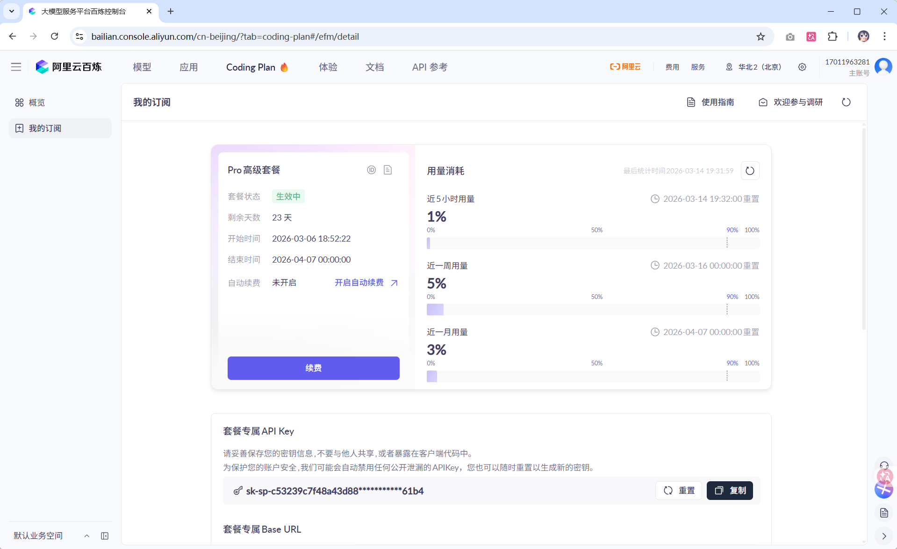
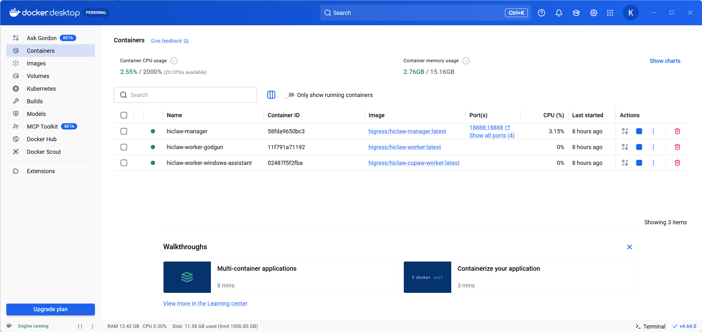
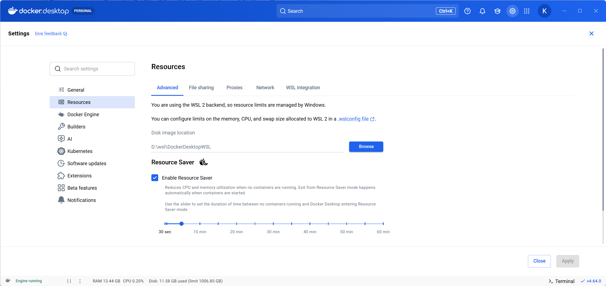
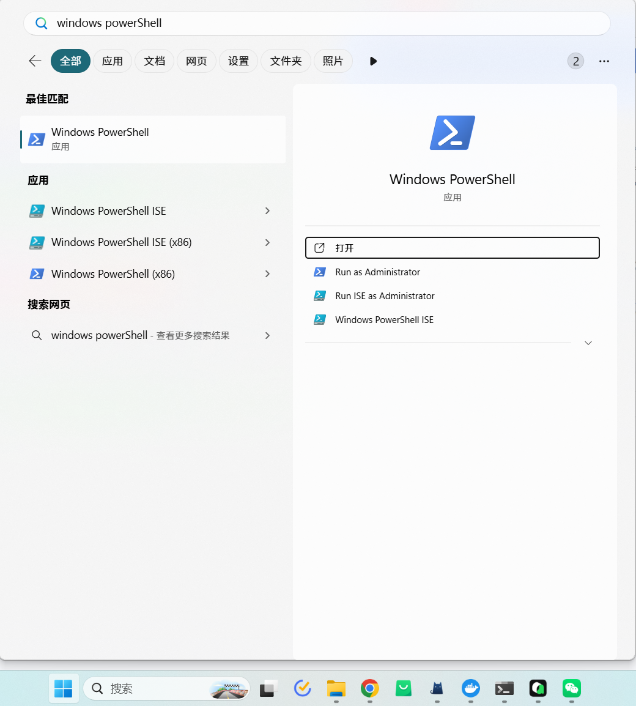
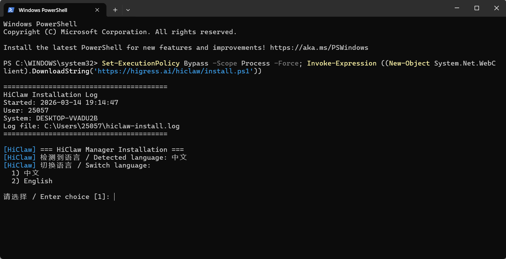
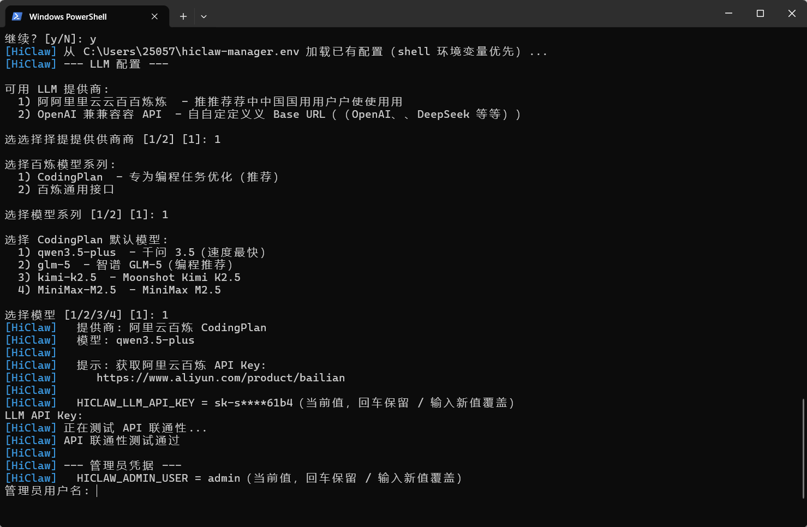
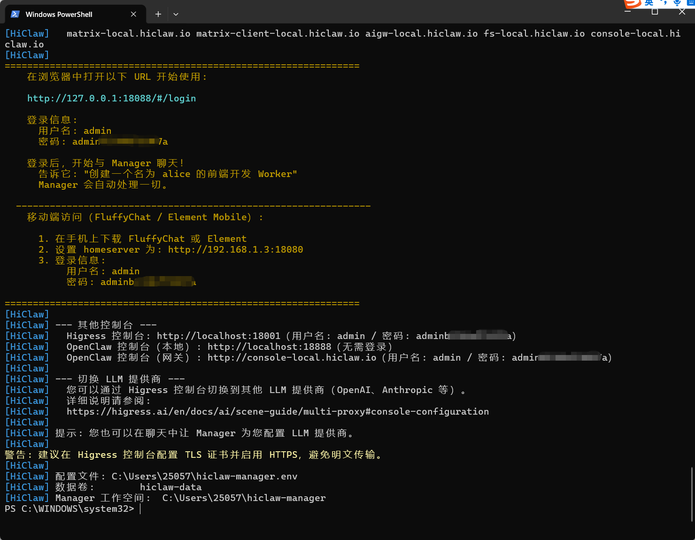
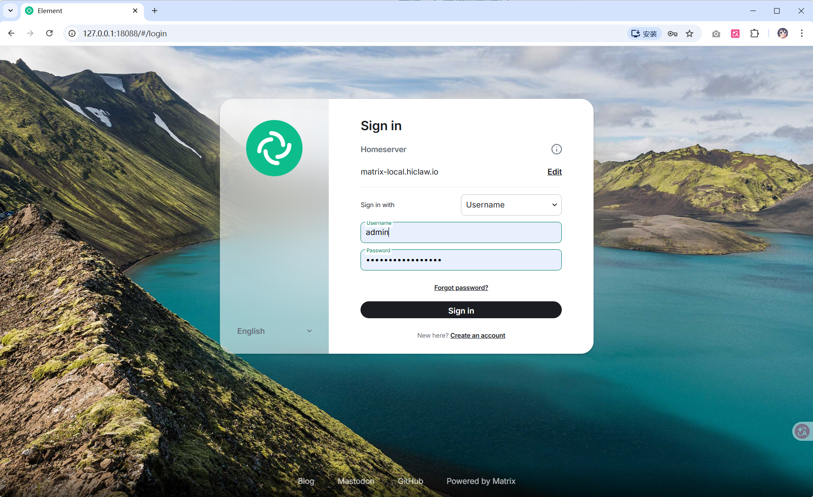
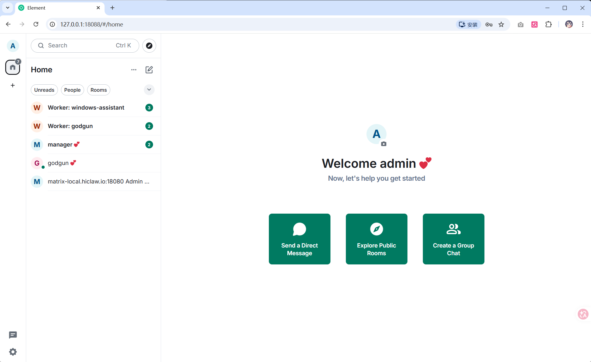

# HiClaw Windows 部署手册

本文介绍如何在 Windows 系统上部署 HiClaw 多智能体协作平台。即使你是第一次接触 Docker 和 Agent 系统，也能按照本手册顺利完成安装。

---

## 目录

- [前提条件](#前提条件)
  - [操作系统要求](#操作系统要求)
  - [硬件要求](#硬件要求)
  - [软件依赖](#软件依赖)
  - [获取 API Key](#获取-api-key)
- [步骤一：安装并启动 Docker Desktop](#步骤一安装并启动-docker-desktop)
- [步骤二：运行安装脚本](#步骤二运行安装脚本)
- [步骤三：选择语言](#步骤三选择语言)
- [步骤四：选择安装模式](#步骤四选择安装模式)
- [步骤五：选择大模型服务商](#步骤五选择大模型服务商)
- [步骤六：选择模型接口](#步骤六选择模型接口)
- [步骤七：选择模型系列](#步骤七选择模型系列)
- [步骤八：输入 API Key 并测试联通性](#步骤八输入-api-key-并测试联通性)
- [步骤九：选择网络访问模式](#步骤九选择网络访问模式)
- [步骤十：确认端口和域名配置](#步骤十确认端口和域名配置)
- [步骤十一：可选配置](#步骤十一可选配置)
- [步骤十二：选择 Worker 运行时](#步骤十二选择-worker-运行时)
- [步骤十三：等待安装完成](#步骤十三等待安装完成)
- [步骤十四：登录 Element Web 开始使用](#步骤十四登录-element-web-开始使用)
- [升级](#升级)
- [卸载](#卸载)
- [常见问题](#常见问题)

---

## 前提条件

### 操作系统要求

- Windows 10（64 位）1903 或更高版本，或 Windows 11
- 已启用 WSL 2（Windows Subsystem for Linux 2）。Docker Desktop 安装时会自动提示启用
- **不支持**：虚拟机（VM）中的 Windows 系统，因为 VM 中无法运行 Linux Container

### 硬件要求

| 配置 | 最低要求 | 推荐配置 |
|------|---------|---------|
| CPU | 2 核 | 4 核及以上 |
| 内存 | 4 GB | 8 GB 及以上 |
| 磁盘 | 10 GB 可用空间 | 20 GB 及以上 |

> **说明**：如果你计划部署多个 Worker Agent 来体验更强大的 Agent Teams 能力，建议使用 4C8GB 以上配置。OpenClaw 运行时单个 Worker 约占用 500MB 内存，CoPaw 运行时仅约 150MB。

### 软件依赖

| 软件 | 要求 | 下载地址 |
|------|-----|---------|
| Docker Desktop | 4.20+ | https://www.docker.com/products/docker-desktop/ |
| PowerShell | 7.0+（推荐） | https://learn.microsoft.com/zh-cn/powershell/scripting/install/installing-powershell-on-windows |

> **说明**：Windows 系统自带 PowerShell 5.1，但我们建议升级到 PowerShell 7.0+ 以获得更好的兼容性和功能支持。

### 获取 API Key

HiClaw 需要一个大模型 API Key 来驱动 Agent 的智能行为。推荐使用阿里云百炼：

1. 访问 [阿里云百炼](https://www.aliyun.com/product/bailian)，注册/登录阿里云账号
2. 开通百炼服务，获取 API Key
3. （推荐）开通 [CodingPlan](https://bailian.console.aliyun.com/cn-beijing/?source_channel=4qjGAvs1Pl&tab=coding-plan#/efm/index) 服务，编程场景效果更佳

也支持其他 OpenAI 兼容的模型服务（如 OpenAI、DeepSeek 等）。



---

## 步骤一：安装并启动 Docker Desktop

1. 下载 [Docker Desktop for Windows](https://www.docker.com/products/docker-desktop/)
2. 双击安装包，按照向导完成安装。安装过程中如提示启用 WSL 2，请确认启用
3. 安装完成后，启动 Docker Desktop
4. 等待 Docker Desktop 左下角显示绿色图标（Engine running），表示 Docker 引擎已就绪



> **注意**：Docker Desktop 需要一定时间完成启动。请等待左下角状态变为绿色后再执行后续步骤。

5. （可选）确认内存分配：新版 Docker Desktop（v4.20+）使用 WSL 2 后端时，内存由 Windows 自动管理，通常无需手动配置。如果后续遇到 Manager Agent 启动超时，可通过 `.wslconfig` 文件限制或调大 WSL 2 的内存分配：

   在 PowerShell 中执行：
   ```powershell
   notepad "$env:USERPROFILE\.wslconfig"
   ```

   写入以下内容（根据实际情况调整），保存后重启 Docker Desktop：
   ```ini
   [wsl2]
   memory=8GB
   ```



---

## 步骤二：运行安装脚本

1. 点击 Windows 开始菜单，搜索或选择 **Windows PowerShell**



2. 在 PowerShell 窗口中，复制并粘贴以下命令，按回车执行：

```powershell
Set-ExecutionPolicy Bypass -Scope Process -Force; $wc=New-Object Net.WebClient; $wc.Encoding=[Text.Encoding]::UTF8; iex $wc.DownloadString('https://higress.ai/hiclaw/install.ps1')
```

> **说明**：此命令会临时允许当前 PowerShell 窗口执行脚本（不影响系统安全策略），然后从网络下载并运行 HiClaw 安装脚本。

安装脚本启动后，你会看到 HiClaw 的安装引导界面。接下来按照终端提示逐步操作即可。



---

## 步骤三：选择语言

脚本会自动检测系统时区并推荐语言。看到以下提示时：

```
检测到语言 / Detected language: 中文
切换语言 / Switch language:
  1) 中文
  2) English

请选择 / Enter choice [1]:
```

输入 `1` 选择中文（或直接按回车使用默认值），按回车确认。

---

## 步骤四：选择安装模式

```
--- Onboarding 模式 ---

选择安装模式:
  1) 快速开始  - 使用阿里云百炼快速安装（推荐）
  2) 手动配置  - 选择 LLM 提供商并自定义选项

请选择 [1/2]:
```

- **快速开始**（推荐）：使用阿里云百炼，大部分配置使用默认值，只需输入 API Key 即可
- **手动配置**：自定义选择 LLM 服务商，逐项配置每个选项

新手建议选择 `1` 快速开始。


---

## 步骤五：选择大模型服务商

```
可用 LLM 提供商:
  1) 阿里云百炼  - 推荐中国用户使用
  2) OpenAI 兼容 API  - 自定义 Base URL（OpenAI、DeepSeek 等）

选择提供商 [1/2]:
```

- 选择 `1`：使用阿里云百炼（推荐国内用户）
- 选择 `2`：使用 OpenAI、DeepSeek 或其他兼容 OpenAI API 协议的服务商。选择后需手动输入 Base URL


---

## 步骤六：选择模型接口

如果上一步选择了阿里云百炼，会出现以下二级菜单：

```
选择百炼模型系列:
  1) CodingPlan  - 专为编程任务优化（推荐）
  2) 百炼通用接口

选择模型系列 [1/2]:
```

- **CodingPlan**（推荐）：专为编程任务优化的接口，效果更好。需要单独开通，开通地址：[CodingPlan](https://bailian.console.aliyun.com/cn-beijing/?source_channel=4qjGAvs1Pl&tab=coding-plan#/efm/index)
- **百炼通用接口**：百炼通用的模型接口


---

## 步骤七：选择模型系列

如果上一步选择了 CodingPlan，会出现模型选择菜单：

```
选择 CodingPlan 默认模型:
  1) qwen3.5-plus  - 千问 3.5（速度最快）
  2) glm-5  - 智谱 GLM-5（编程推荐）
  3) kimi-k2.5  - Moonshot Kimi K2.5
  4) MiniMax-M2.5  - MiniMax M2.5

选择模型 [1/2/3/4]:
```

根据实际需要选择。安装完成后，也可以通过 Manager 聊天指令切换模型。


---

## 步骤八：输入 API Key 并测试联通性

脚本会提示你输入 API Key：

```
  提示: 获取阿里云百炼 API Key:
     https://www.aliyun.com/product/bailian

LLM API Key: ****
```

粘贴你的 API Key（输入时不会显示明文，属于正常现象），按回车确认。

脚本随后会自动测试 API 联通性。若测试成功，你会看到：

```
[HiClaw] API 联通性测试通过
```



> **如果测试失败**：
> - 检查 API Key 是否完整粘贴，有无多余空格
> - 确认已开通对应的模型服务（如 CodingPlan 需要单独开通）
> - 确认网络可以访问阿里云 API 服务
> - 如多次尝试仍失败，建议向模型服务商提交工单

---

## 步骤九：选择网络访问模式

```
--- 网络访问模式 ---

  1) 仅本机使用，无需开放外部端口（推荐）
  2) 允许外部访问（局域网 / 公网）

请选择 [1/2]:
```

- 选择 `1`（推荐）：端口绑定到 `127.0.0.1`，仅本机可访问，安全性更高
- 选择 `2`：端口绑定到 `0.0.0.0`，局域网内其他设备可访问。适用于需要手机端访问或与同事共享的场景

> **安全提示**：如果选择允许外部访问，建议后续在 Higress 控制台配置 TLS 证书并启用 HTTPS，避免明文传输。

---

## 步骤十：确认端口和域名配置

脚本会依次提示以下配置项，**直接按回车即可使用默认值**，无需手动修改：

| 配置项 | 默认值 | 说明 |
|--------|--------|------|
| 网关主机端口 | 18080 | Higress 网关端口 |
| Higress 控制台端口 | 18001 | 管理控制台 |
| Element Web 端口 | 18088 | IM 客户端访问端口 |
| OpenClaw 控制台端口 | 18888 | Agent 控制台 |
| Matrix 域名 | matrix-local.hiclaw.io:18080 | Matrix 服务器域名 |
| Element Web 域名 | matrix-client-local.hiclaw.io | IM 客户端域名 |
| AI 网关域名 | aigw-local.hiclaw.io | AI 网关域名 |
| 文件系统域名 | fs-local.hiclaw.io | MinIO 文件系统域名 |
| OpenClaw 控制台域名 | console-local.hiclaw.io | Agent 控制台域名 |

> **说明**：以上域名在本机部署时会自动解析到 `127.0.0.1`，无需手动配置 DNS 或 hosts 文件。

---

## 步骤十一：可选配置

以下配置均可直接按回车跳过，使用默认值：

| 配置项 | 说明 | 默认值 |
|--------|------|--------|
| GitHub 个人访问令牌 | 用于 Worker 执行 GitHub 操作（PR、Issue 等） | 留空跳过 |
| Skills 注册中心 URL | Worker 获取技能的来源 | https://skills.sh |
| Docker 卷名称 | 持久化数据存储 | hiclaw-data |
| Manager 工作空间目录 | 存放 Agent 配置和状态 | `%USERPROFILE%\hiclaw-manager` |


---

## 步骤十二：选择 Worker 运行时

```
--- 默认 Worker 运行时 ---

  1) OpenClaw（Node.js 容器，~500MB 内存）
  2) CoPaw（Python 容器，~150MB 内存，默认关闭控制台，可跟 Manager 对话按需开启）

请选择 [1/2]:
```

| 运行时 | 内存占用 | 特点 |
|--------|---------|------|
| OpenClaw | ~500MB | 功能丰富，内置 Web 控制台 |
| CoPaw | ~150MB | 更轻量，适合资源有限的环境 |

根据你的机器配置选择。如内存充裕选 `1`，如希望节省资源选 `2`。

---

## 步骤十三：等待安装完成

选择完成后，脚本将自动执行以下操作：

1. 生成配置文件和密钥
2. 拉取 Manager 和 Worker 的 Docker 镜像（首次安装需要下载约 2-3 GB，取决于网络速度）
3. 创建并启动 Manager 容器
4. 等待 Manager Agent 就绪
5. 等待 Matrix 服务就绪
6. 发送初始化消息

```
[HiClaw] 正在拉取 Manager 镜像: higress-registry.cn-hangzhou.cr.aliyuncs.com/higress/hiclaw-manager:latest
[HiClaw] 正在拉取 Worker 镜像: higress-registry.cn-hangzhou.cr.aliyuncs.com/higress/hiclaw-worker:latest
[HiClaw] 正在启动 Manager 容器...
[HiClaw] 等待 Manager Agent 就绪（超时: 300s）...
[HiClaw] Manager Agent 已就绪！
[HiClaw] 等待 Matrix 服务就绪（超时: 300s）...
[HiClaw] Matrix 服务已就绪！
```

安装成功后，你会看到包含登录信息的面板：

```
===============================================================
  在浏览器中打开以下 URL 开始使用:

    http://127.0.0.1:18088/#/login

  登录信息:
    用户名: admin
    密码: admin<随机字符串>

  登录后，开始与 Manager 聊天！
    告诉它: "创建一个名为 alice 的前端开发 Worker"
    Manager 会自动处理一切。
===============================================================
```

> **请务必记录用户名和密码**，密码是自动生成的随机字符串。配置信息保存在 `%USERPROFILE%\hiclaw-manager.env` 文件中，可随时查看。



---

## 步骤十四：登录 Element Web 开始使用

1. 打开浏览器，访问 http://127.0.0.1:18088/#/login
2. 输入上一步输出的用户名和密码
3. 登录后，你会看到与 Manager 的对话窗口
4. 在对话框中发送消息，开始与 Manager 交互





**快速体验**：发送以下消息让 Manager 为你创建第一个 Worker：

```
帮我创建一个名为 alice 的前端开发 Worker
```

Manager 会自动完成以下工作：
- 注册 alice 的 Matrix 账号
- 在 Higress 中创建 Consumer（含安全凭据）
- 在 MinIO 中生成配置文件
- 创建三方房间（你、Manager、alice）
- 启动 Worker 容器

创建完成后，你可以在 alice 的房间中直接分配任务。

### 移动端访问（可选）

如果安装时选择了"允许外部访问"，你可以通过手机上的 Matrix 客户端（FluffyChat 或 Element Mobile）随时随地管理 Agent 团队：

1. 在手机上下载 FluffyChat 或 Element
2. 设置 homeserver 为：`http://<你的电脑局域网IP>:18080`
3. 使用安装时输出的用户名和密码登录

---

## 升级

每次有新版本发布时，在 PowerShell 中重新执行安装命令即可原地升级：

```powershell
Set-ExecutionPolicy Bypass -Scope Process -Force; $wc=New-Object Net.WebClient; $wc.Encoding=[Text.Encoding]::UTF8; iex $wc.DownloadString('https://higress.ai/hiclaw/install.ps1')
```

安装脚本检测到已有安装时，会提示选择：

- **就地升级**（推荐）：保留所有数据、配置和工作空间，仅更新容器镜像
- **全新重装**：删除所有数据，从零开始

> 升级过程中，Manager 容器和 Worker 容器都会被重新创建。Worker 是无状态的，数据存储在 MinIO 中不会丢失。

如需升级到指定版本：

```powershell
$env:HICLAW_VERSION="v1.0.5"; Set-ExecutionPolicy Bypass -Scope Process -Force; $wc=New-Object Net.WebClient; $wc.Encoding=[Text.Encoding]::UTF8; iex $wc.DownloadString('https://higress.ai/hiclaw/install.ps1')
```

---

## 卸载

在 PowerShell 中执行以下命令，将停止并删除所有 HiClaw 容器、Docker 卷和配置文件：

```powershell
Set-ExecutionPolicy Bypass -Scope Process -Force; Invoke-Expression "& { $(Invoke-WebRequest -Uri 'https://higress.ai/hiclaw/install.ps1' -UseBasicParsing).Content } uninstall"
```

> **说明**：卸载操作会保留 Manager 工作空间目录（`%USERPROFILE%\hiclaw-manager`），如需彻底清理请手动删除。

---

## 常见问题

### PowerShell 执行脚本闪退

**现象**：执行安装命令后，PowerShell 窗口立即关闭。

**排查步骤**：
1. 确认 Docker Desktop 已安装并完全启动（左下角显示绿色图标）
2. 右键点击开始菜单 → 打开 **Windows PowerShell**（不是 CMD 命令提示符）
3. 先手动执行 `docker info` 确认 Docker 可用
4. 再执行 HiClaw 安装命令

### Docker Desktop 未运行

**现象**：出现错误 `Docker 未运行。请先启动 Docker Desktop 或 Podman Desktop。`

**解决方案**：启动 Docker Desktop，等待左下角图标变绿后重试。

### 镜像拉取超时

**现象**：安装过程中长时间卡在镜像拉取阶段。

**解决方案**：
- 安装脚本会根据时区自动选择最近的镜像仓库（中国用户使用杭州节点），一般无需额外配置
- 如果网络环境特殊，可以在 Docker Desktop → **Settings** → **Docker Engine** 中配置镜像加速器

### API 联通性测试失败

**现象**：安装过程中提示 `API 联通性测试失败`。

**排查步骤**：
1. 确认 API Key 完整粘贴，无多余空格
2. 如使用 CodingPlan，确认已开通 CodingPlan 服务：[开通地址](https://bailian.console.aliyun.com/cn-beijing/?source_channel=4qjGAvs1Pl&tab=coding-plan#/efm/index)
3. 在浏览器中访问 https://dashscope.aliyuncs.com 确认网络可达
4. 如多次失败，可选择继续安装（脚本会询问），安装后在 Higress 控制台重新配置

### Manager Agent 启动超时

**现象**：安装日志卡在 `等待 Manager Agent 就绪...` 超过 5 分钟。

**排查步骤**：
1. 检查 WSL 2 可用内存是否不足。新版 Docker Desktop 使用 WSL 2 后端，内存由 Windows 管理。在 PowerShell 中执行 `wsl --status` 查看配置。如需调大，编辑 `%USERPROFILE%\.wslconfig`，设置 `memory=8GB`，保存后重启 Docker Desktop
2. 查看 Manager 容器日志：
   ```powershell
   docker logs hiclaw-manager
   ```
3. 查看 Agent 详细日志：
   ```powershell
   docker exec hiclaw-manager cat /var/log/hiclaw/manager-agent.log
   ```

### 端口被占用

**现象**：安装成功但无法访问 Element Web。

**排查步骤**：
1. 检查 18088 端口是否被其他程序占用：
   ```powershell
   netstat -ano | findstr "18088"
   ```
2. 如端口被占用，重新安装时选择"手动配置"模式，更换端口号

### 如何查看当前安装的配置

配置信息保存在以下位置：

| 文件 | 位置 | 说明 |
|------|------|------|
| 环境变量配置 | `%USERPROFILE%\hiclaw-manager.env` | 所有安装配置（含密码） |
| Manager 工作空间 | `%USERPROFILE%\hiclaw-manager\` | Agent 配置、技能、记忆 |
| 安装日志 | `%USERPROFILE%\hiclaw-install.log` | 安装过程完整日志 |

在 PowerShell 中查看密码：

```powershell
Select-String "HICLAW_ADMIN_PASSWORD" "$env:USERPROFILE\hiclaw-manager.env"
```

---

## 附录：其他管理控制台

安装完成后，除了 Element Web，你还可以访问以下控制台：

| 控制台 | 地址 | 用途 |
|--------|------|------|
| Element Web | http://127.0.0.1:18088 | IM 客户端，与 Agent 对话 |
| Higress 控制台 | http://localhost:18001 | AI 网关管理、LLM 切换、凭证管理 |
| OpenClaw 控制台 | http://localhost:18888 | Agent 运行时管理（仅本机访问） |

> **提示**：你也可以在 Element Web 聊天中让 Manager 帮你配置 LLM 提供商，无需手动操作 Higress 控制台。
